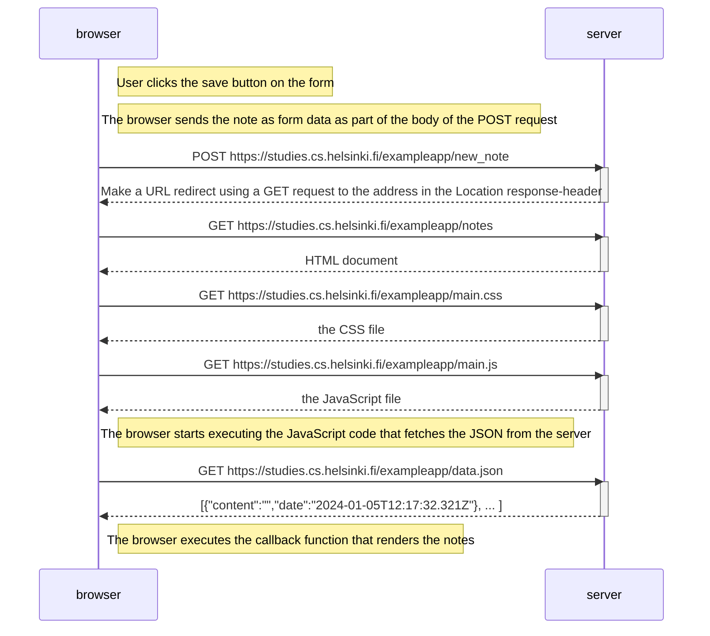

```mermaid
sequenceDiagram
    participant browser
    participant server

    Note right of browser: User clicks the save button on the form
    Note right of browser: The browser sends the note as form data as part of the body of the POST request

    browser->>server: POST https://studies.cs.helsinki.fi/exampleapp/new_note
    activate server
    server-->>browser: Make a URL redirect using a GET request to the address in the Location response-header
    deactivate server

    browser->>server: GET https://studies.cs.helsinki.fi/exampleapp/notes
    activate server
    server-->>browser: HTML document
    deactivate server

    browser->>server: GET https://studies.cs.helsinki.fi/exampleapp/main.css
    activate server 
    server-->>browser: the CSS file
    deactivate server

    browser->>server: GET https://studies.cs.helsinki.fi/exampleapp/main.js
    activate server
    server-->>browser: the JavaScript file
    deactivate server

    Note right of browser: The browser starts executing the JavaScript code that fetches the JSON from the server

    browser->>server: GET https://studies.cs.helsinki.fi/exampleapp/data.json
    activate server
    server-->>browser: [{"content":"","date":"2024-01-05T12:17:32.321Z"}, ... ] 
    deactivate server

    Note right of browser: The browser executes the callback function that renders the notes
```