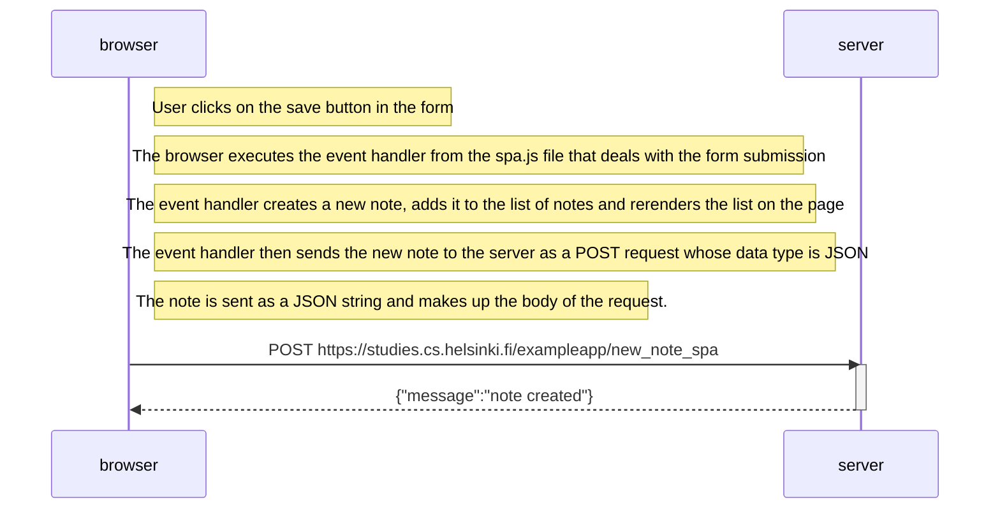

```mermaid
sequenceDiagram
    participant browser
    participant server 

    Note right of browser: User clicks on the save button in the form
    Note right of browser: The browser executes the event handler from the spa.js file that deals with the form submission
    Note right of browser: The event handler creates a new note, adds it to the list of notes and rerenders the list on the page
    Note right of browser: The event handler then sends the new note to the server as a POST request whose data type is JSON
    Note right of browser: The note is sent as a JSON string and makes up the body of the request.

    browser ->> server: POST https://studies.cs.helsinki.fi/exampleapp/new_note_spa
    activate server 
    server -->> browser: {"message":"note created"}
    deactivate server
```